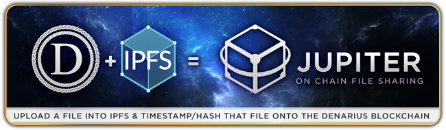
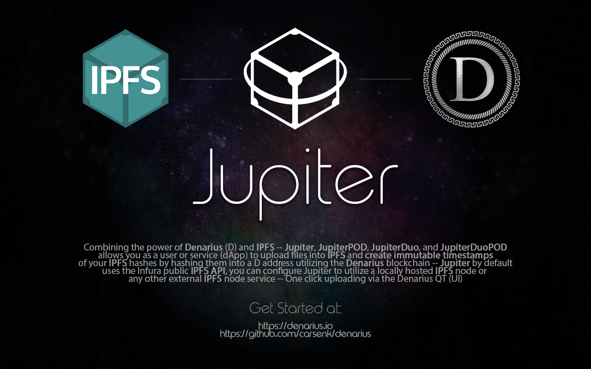

+++
title = "Jupiter"
date = 2020-03-04T23:06:14-08:00
weight = 45
chapter = true
pre = "<b></b>"
+++

### Jupiter POD

What is Interplanetary File System (IPFS)?

"A peer-to-peer hypermedia protocol designed to make the web faster, safer, and more open." https://ipfs.io/

Why use IPFS?

A decentralized storage option to keep control of your files with or without relying on internet backbone connectivity. Distribute this data without duplication, by keeping every version of your files, creating mirrored data that is resilient.

Why use Proof of Data (POD)?

Proof of Data is blockchain based hashing and time stamping to authenticate your file on the Denarius blockchain. Remove a third party for trust using mathematical proof, but can be verified by third parties.

What is Jupiter POD?

Jupiter - Publish and share your files permanently without the threat of anyone tampering with the authenticity of your work.
POD - Proof of Data hash and timestamp your uploaded file to the Denarius blockchain to prove authenticity at time of upload.

