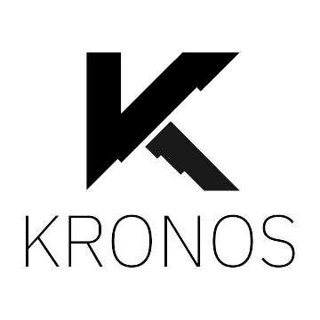

+++
title = "Kronos"
date = 2020-12-04T22:46:54-08:00
weight = 3
chapter = true
pre = "<b></b>"
+++

### Kronos Wallet

# Multi-Wallet

A Dashboard Interface and Wallet for Denarius (D), Bitcoin (BTC), Ethereum (ETH), and Denarii (ARI) in NodeJS and Electron. The Kronos Wallet is also now available on Windows, macOS, and Linux platforms. (You can access it on mobile from your local network).  

Supports D, BTC, ETH, and ARI. More coming!  

https://github.com/carsenk/kronos/releases  

