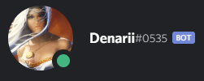

+++
title = "denarii"
date = 2020-03-04T22:44:28-08:00
weight = 40
chapter = true
pre = "<b></b>"
+++

### denarii

# Chat Bot

[Join Denarius Discord](https://discord.gg/mDTM3JN)  

denarii is a custom Discord chat bot. discord id is `558372076562415622`. 

List of commands below.

`
denarii d
`
```
:send: Denarius [D] on CoinGecko
Price: $0.14 USD (0.00001495 :btc:)
Market Rank #689 - Gecko Rank #251      
Market Cap: $990531 USD      
Supply: 7279099.08260416 D / 10m D      
24h Volume: $1228.96 USD      
24h: -3.35 % 7d: 72.36 % 30d: 65.14 %      
ATH: $4.58 USD ATL: $0.000027 USD      
24h High: $0.15 USD 24h Low: $0.12 USD
```
`
denarii btc
`
```
:btc: Bitcoin [BTC] on CoinGecko
Price: $9101.11 USD for 1 :btc:
Market Rank #1 - Gecko Rank #1      
Market Cap: $166059884634 USD      
Supply: 18256462 BTC / 21m BTC      
24h Volume: $41348573789.00 USD      
24h: 0.07 % 7d: 3.64 % 30d: -0.86 %      
ATH: $19665.39 USD ATL: $67.81 USD      
24h High: $9152.04 USD 24h Low: $9008.53 USD
```
`
denarii but
`


`
denarii cg
`
```
:send: Denarius on CoinGecko
Price: $0.14 USD (0.00001584 ₿)
Market Rank #667 - Gecko Rank #251      
Market Cap: $1045261 USD      
Supply: 7278737.9263322 D / 10,000,000 D      
24h Volume: $517.51 USD      
24h: 6.29 % 7d: 81.88 % 30d: 74.26 %      
ATH: $4.58 USD ATL: $0.000027 USD      
24h High: $0.16 USD 24h Low: $0.13 USD
```
`
denarii gecko
`
```
:send: Denarius on CoinGecko
Price: $0.14 USD (0.00001584 ₿)
Market Rank #667 - Gecko Rank #251      
Market Cap: $1045261 USD      
Supply: 7278737.9263322 D / 10,000,000 D      
24h Volume: $517.51 USD      
24h: 6.29 % 7d: 81.88 % 30d: 74.26 %      
ATH: $4.58 USD ATL: $0.000027 USD      
24h High: $0.16 USD 24h Low: $0.13 USD
```
`
denarii markets
`
```
>>>https://tradeogre.com/exchange/BTC-D
https://coinvex.org/market/BTC-D
https://southxchange.com/Market/Book/D/BTC
https://altilly.com/market/D_BTC
```
`
denarii southx
`
```
[OK] D-BTC on Southx [https://www.southxchange.com/Market/Book/D/BTC] [Last Price: 0.00001596] - [Change: -6.77%] - [Vol: 7382.45386774 D] - [Vol: 0.11782396 BTC] - [Bid: 0.00001431] - [Ask: 0.00001596]
```
`
denarii tradeogre
`
```
[OK] D-BTC on TradeOgre [https://tradeogre.com/exchange/BTC-D] [Last Price: 0.00001198] - [High: 0.00001539] - [Low: 0.00001198] - [Vol: 0.02805763 BTC] - [Vol: 2342.0392320534224 D] - [Bid: 0.00001204] - [Ask: 0.00001474] - [Initial Price: 0.00001539]
```
`denarii emissions
`
```
:send: Denarius [D]
Minted in the last 2880 blocks
2552.32280375 :coinomi:
```
`
denarii corona
`
```
Disease: COVID-19 - Virus: SARS-CoV-2 - Confirmed Infections: 97886 :microbe: - Deaths: 3348 :skull: - Recovered: 53797 :green_heart: - Data Updated: 3/5/20
```
`
denarii bae
`
```
Thank you! Such a nice compliment! I will be watching you.
```
`
denarii wtf
`
```
What?
```
`
denarii F
`
```
:F_:
```
`
denarii thank you
`
```
Your welcome! I hope your day is going fantastic!
```
`
denarii tell me a joke
`
```
How did the vegan start eating meat? Cold turkey.
```
`
denarii encourage @BuzzkillB 
`
```
BuzzkillB has a great reputation.
```
`
denarii what is fs
`
`
denarii fscount
`
```
[OK] D [FortunaStake Online Count: 496 - FortunaStake Cost: 5000 D - FS Reward: 33% of PoW/PoS Blocks]
```
`
denarii hash <blocknumber>
`
```
D Block #0 Hash: 00000d5dbbda01621cfc16bbc1f9bf3264d641a5dbf0de89fd0182c2c4828fcd
```
`
denarii chain
`
```
:coinomi: [Block Height: 3020749] - [Block Hash: 772834e5ffd4f903e88858dc37ed1566a7a64d61cea0b9939424316c4cee4ce1] - [Money Supply: 7278835.89317818 D] - [Diff: PoW 145.50072 / PoS 0.00024]
```
`
denarii height
`
```
>>>D Block Height: 3020749
```
`
denarii ship it
`
```
IMAGE OF SQUIRRELS
```
